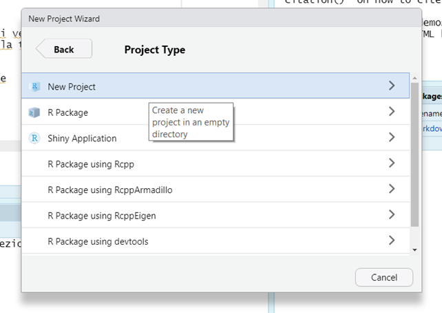

```{r setup, include=FALSE}
knitr::opts_chunk$set(echo = T, 
                      warning = F, 
                      message = F, 
                      fig.align = "center", 
                      out.width = "90%", 
                      class.output="scroll-100")
hook_output <- knitr::knit_hooks$get("output")
knitr::knit_hooks$set(purl = knitr::hook_purl)

knitr::knit_hooks$set(output = function(x, options) {
  if (!is.null(n <- options$out.lines)) {
    x <- xfun::split_lines(x)
    if (length(x) > n) {
      # truncate the output
      x <- c(head(x, n), "....\n")
    }
    x <- paste(x, collapse = "\n")
  }
  hook_output(x, options)
})
library(TAM)
library(mokken)
library(lavaan)
library(difR)
library(sirt)
library(ggplot2)
library(tidyverse)
set.seed(999)
N = 1000
b <- runif(5, -3,3)
a = c(runif(5, 0.4, 2))
true_theta = seq(-4, 4, length.out = N)
data <- sirt::sim.raschtype( true_theta, b=b, 
                             fixed.a = a)
true_thetaES = seq(-5, 2, length.out = N-200)
bES <- runif(8, -5,5)
aES = rep(1, 8)

dataES = sirt::sim.raschtype(true_thetaES, b = bES, fixed.a=aES)

```


```{css, echo=F, eval = T}
pre {
  max-height: 700px;
  overflow-y: auto;
}
pre[class] {
  max-height: 500px;
}
.scroll-100 {
  max-height: 500px;
  overflow-y: auto;
}

.inverse {
  background-color: #272822;
  color: #d6d6d6;
  text-shadow: 0 0 20px #333;
}


.scrollable {
  height: 500px;
  overflow-y: auto;
}


.scrollable-auto {
  height: 80%;
  overflow-y: auto;
}

.remark-slide-number {
  display: none;
}
```


---
class: section, center, middle

# Getting started 

---

## Create a new project I 
(This is not mandatory by it is strongly suggested)

New file $\rightarrow$ New project

```{r, echo = F}
knitr::include_graphics("img/project1.png")
```
---


## Create a new project II 

.pull-left[ 
```{r echo = F}

```

]

.pull-right[
```{r echo = F}
knitr::include_graphics("img/project3.png")
```

]


---


## Packages

.pull-left[
.center[Installation -- Run only once]
```{r, eval = F, echo = T}
install.packages("lavaan")

install.packages("TAM")

install.packages("mokken")

install.packages("difR")

install.packages("tidyverse")

install.packages("ggplot2")


```


]


.pull-right[
.center[Upload in `R` -- Everytime]

```{r, eval = F, echo = T}
library("lavaan")

library("TAM")

library("mokken")

library("difR")

library("tidyverse")

library("ggplot2")

```


]

---

## Useful code


```{r}
# probability of a correct response given theta and item parameters
IRT <- function(theta, a = 1, b = 0, c = 0,e = 1) {
  y <- c + (e - c) * exp(a * (theta - b)) / (1 + exp(a * (theta - b)))
  y[is.na(y)] = 1
  return(y)
}


```

---

## Useful code II


.scrollable[

```{r}
# function for plotting the ICCs of the items 
# returns a list with a ggplot graph (icc_graph) and a data set with the data 
# used for plotting the ICC (icc_data)
irt_icc = function(model) {
  item_par = model$item
  est_theta = seq(-4,4, length.out=1000)
  item_prob = list()
  if (any(grep("guess", colnames(item_par))) == F) {
    for (i in 1:nrow(item_par)) {
      item_prob[[i]] = data.frame(theta = est_theta)
      item_prob[[i]]$it_p = IRT(item_prob[[i]]$theta, 
                          b = item_par[i, "xsi.item"], 
                          a = item_par[i, "B.Cat1.Dim1"])
      item_prob[[i]]$item = item_par[i, "item"]

}
  } else {
     for (i in 1:nrow(item_par)) {
      item_prob[[i]] = data.frame(theta = est_theta)
      item_prob[[i]]$it_p = IRT(item_prob[[i]]$theta, 
                          b = item_par[i, "AXsi_.Cat1"], 
                          a = item_par[i, "B.Cat1.Dim1"], 
                          c = item_par[i, "guess"])
      item_prob[[i]]$item = item_par[i, "item"]

}
  }
  p = do.call("rbind", item_prob)
  gp = ggplot(p, 
       aes(x = theta, y = it_p, group = item, col =
             item)) + geom_line(lwd = 1)
  object = list(icc_data = p, 
              icc_graph = gp)

return(object)
}
```
]


---

## Useful code III

.scrollable[
```{r}
irt_iif = function(model) {
  est_theta = IRT.factor.scores(model, 
                              type = "EAP")$EAP
ii = IRT.informationCurves(model, theta = est_theta)

test_info = data.frame(theta = est_theta, 
               info = ii$test_info_curve, 
               se = ii$se_curve)

iif_info = list()
for(i in 1:nrow(ii$info_curves_item)) {
    iif_info[[i]] = data.frame(theta = est_theta)
    iif_info[[i]]$ii_item = ii$info_curves_item[i, ]
    iif_info[[i]]$item = dimnames(ii$info_curves_item)[[1]][i]
}

dat_info = do.call("rbind", iif_info)

info_tot = list(test_info = test_info, 
                item_info = dat_info)

return(info_tot)
}

```

]


---
class: section, center, middle

# Data import

---

## Import data in R


.scrollable[
Download the file  `dataClass.csv` from this shared folder [Dati](https://drive.google.com/drive/folders/1PXDG7HhjRDMdFEQjk5WQQWdiorDpSgtw?usp=sharing)

Store the downloaded file in the `Data` sub folder of your newly created project and run this code: 

```{r eval = F}
data = read.csv("Data/dataClass.csv", header = T, sep = ",")
```
]

---

## Look at the data - Item I

.scrollable[

```{r eval = F}
vis_data = data
vis_data$id = paste0("s", 1:nrow(data))

vis_data = vis_data[, c(ncol(vis_data), 1:ncol(data))]
vis_data = pivot_longer(vis_data, names_to = "item", cols = -1)

prop_data = vis_data %>% 
  group_by(item) %>%  
  summarise(proportion = mean(value))

ggplot(prop_data, 
       aes(x = reorder(item, proportion), y=proportion, 
           fill = item)) + geom_bar(stat = "identity") + 
  theme(axis.text = element_text(angle = 90)) + geom_hline(aes(yintercept=.50), linetype = 2) + 
  theme_light() + ylim(0, 1)


```

```{r eval = T,echo = F}
vis_data = data
vis_data$id = paste0("s", 1:nrow(data))

vis_data = vis_data[, c(ncol(vis_data), 1:ncol(data))]
vis_data = pivot_longer(vis_data, names_to = "item", cols = -1)

prop_data = vis_data %>% 
  group_by(item) %>%  
  summarise(proportion = mean(value))

ggplot(prop_data, 
       aes(x = reorder(item, proportion), y=proportion, 
           fill = item)) + geom_bar(stat = "identity") + 
  theme(axis.text = element_text(angle = 90)) + geom_hline(aes(yintercept=.50), linetype = 2) + ylab("Proportion correct") + xlab("") + 
  theme_light() + ylim(0, 1) + 
  theme( 
    legend.position = "none", 
    axis.title = element_text(size = 26), 
    axis.text = element_text(size = 22))
```


]

---


## Look at the data - Respondents
.scrollable[
```{r}
sbj_data = data
sbj_data$id = paste0("s", 1:nrow(data))
sbj_data = sbj_data[, c(ncol(sbj_data), 1:ncol(data))]

sbj_data$sum = rowSums(sbj_data[,-1])

boxplot(sbj_data$sum)

```
]

---

class: section, center, middle

# Assumptions

---


## IRT assumptions 

There are three main assumptions: 

1. Unidimensionality 

2. Monotonicity 

3. Local independence 

If these assumptions are violated, the models can still be fitted but their interpretation if meaningless

---

## Unidimensionality

.center[What]

Unidimensionality $\rightarrow$ There's only one latent trait that is responsible of the observed responses 

.center[How]


**Confirmatory Factor Analysis models** (CFA)

--

.center[If violated]

The parameter estimates might be distorted and/or could not be interpreted

Even if the estimates could be interpreted, they would have no meaning because the model has no meaning 

-- 

.center[Execption]

There are IRT models that are designed for dealing with multidimensional latent traits

---


## Unidimensionality - CFA

CFA models that force a one-factor solution to the data: 

- If the one-factor model presents a good fit to the data $\rightarrow$ it is reasonable to assume the unidimensionality

- If the one-factor model presents does not present a good fit to the data $\rightarrow$ unidimensionality is not supporteed, it is best to first understand the latent structure of the data

--

.center[How]

CFA fit indexes: 

Comparative Fit Index (CFI) $> .90$


Standardized Root Mean Square Residual (SRMSR) $<.08$

Root Mean Square Error of Approximation (RMSEA) $<. 08$

---

## Unidimensionality - Practice 

The CFA model is fitted with the `lavaan` package:

.scrollable[
```{r}

item_lab = paste(colnames(data), collapse = " + ")
form = paste("latent =~", item_lab)

form

```

```{r}
model = cfa(form, data = data,  ordered = colnames(data))
summary(model, fit.measures = T)
```

]

---

## Monotonicity 

.center[What]

The probability of responding correctly increases as the the level of the latent trait increases

.center[How]

Monotonicitiy is evaluated at the item level with $H$ coefficient by Mokken: 

   $H \leq .30$ $\rightarrow$ The item is not monotone, should be discarded
   
   $.30 < H \leq .50$ $\rightarrow$ The item is essentially monotone, this is fine 
   
   $H > .50$ $\rightarrow$ The item is monotone, this is otpimal
   

.center[If violated]

Issues on the reliability and validity of the measure 

   
---


## Monotonicity in R

Monotonicity is checked with the `mokken` package in `R`:

```{r}
library(mokken)
mono_check = check.monotonicity(data)
summary(mono_check)
```


---

## Local independence 


.center[What]

The probability of the observing certain responses to a set of items is equal to the product of the probabilities associated with each response to each item: 

$$P(x_{p1}, x_{p2}, \ldots, x_{pi}) = P(x_{p1})P(x_{p2}) \ldots P(x_{pi})$$

The correlation between the observed responses "disappears" once the effect of the latent variable has been taken into account


.center[If violated]

There is something else other than the latent variable, issues for the validity and reliability of the measure 


---

## Local indepedence - How


It is based on the correlations between the residuals of the IRT model $\rightarrow$ the distance between the observed data and the data expected according to the model 


Under the assumption of local independence, the residuals are expected not to be correlated 

The usual statistics for interpreting the correlation between the residuals is the $Q3$ statistics (Yen, 1984) 

This statistics is computed for every pair of items

$Q3 > .20$ suggests an high correlation between the residuals of two items, indicating local dependence $\rightarrow$ one of the item should be deleted 


---

class: section, center, middle

# Model estimation

---


## Model estimation in R

Multiple-choice items, coded as 0 (incorrect response) and 1 (correct response): 

.scrollable[
```{r}
m1pl = tam.mml(data, verbose = F)

m2pl = tam.mml.2pl(data, irtmodel = "2PL", verbose = F)

m3pl = tam.mml.3pl(data, est.guess = colnames(data),
                     verbose = F)

```

]

---
## Model comparison 

```{r}
IRT.compareModels(m1pl, m2pl, m3pl)
```


---

## 2PL - Model fit 


```{r}
f.m2pl = tam.modelfit(m2pl, progress = F)
f.m2pl$statlist

f.m2pl$modelfit.test
```


---


---

## 2PL - Fit 

```{r}
fit_m2pl = tam.modelfit(m2pl, progress = F)

fit_m2pl$statlist


fit_m2pl$modelfit.test

```


---

## Local dependence

```{r}
fit_m2pl$Q3_summary
```


---


## 2PL - Item parameters


```{r eval = TRUE, echo = FALSE, out.width="60%"}
icc_2pl = irt_icc(m2pl)$icc_data 
item = m2pl$item_irt
icc_2pl = merge(icc_2pl, item)
icc_2pl$item_label = paste0(icc_2pl$item, ", b =", 
                            round(icc_2pl$beta, 2), ", a = ", round(icc_2pl$alpha, 2))

ggplot(icc_2pl, 
       aes(x = theta, y = it_p, group = item_label, color = item_label)) +
  geom_line(linewidth = 1.2) + theme_classic() + 
  ylab("P(x =1)") + xlab(expression(theta)) +
  theme(legend.position = c(.15, .80), 
        legend.title = element_blank(), 
        legend.text = element_text(size = 18), 
        axis.title = element_text(size = 26)) + 
  geom_hline(yintercept = .50, linetype = 2)


```


---
class: section, center, middle

#  Information Functions
 

---

## 2PL - IIF 


```{r echo = FALSE, out.width="60%"}
label_item = icc_2pl[, c("item", "item_label")]
label_item = label_item %>% distinct()

info2pl = irt_iif(m2pl)
item_info = info2pl$item_info
item_info = merge(item_info, label_item)

ggplot(item_info, 
       aes(x = theta, y = ii_item, group = item_label, color = item_label)) + geom_line(lwd = 1) + theme_light()+ xlab(expression(theta)) + ylab("Info")+
  theme(legend.position = c(.15, .80), 
        legend.title = element_blank(), 
        legend.text = element_text(size = 18), 
        axis.title = element_text(size = 26)) + 
  geom_hline(yintercept = .50, linetype = 2)


```


---


## 2PL - SE

```{r out.width="40%"}

ggplot(info2pl$test_info, 
       aes(x = theta, y = info)) + geom_line(lwd = 2) + theme_bw()


```


## SE 

```{r out.width="40%"}

ggplot(info2pl$test_info, 
       aes(x = theta, y = se, col = "red")) + geom_line(lwd = 2) + theme_bw() + theme(legend.position = "none")


```


---

## SE per il 2PL 

.scrollable[


]


---

---
class: section, center, middle

#  Esercitazione
 

---

## Esercitazione stima

Scaricare il dataset `dataES_stima.csv` dalla cartella [Dati](https://drive.google.com/drive/folders/1PXDG7HhjRDMdFEQjk5WQQWdiorDpSgtw?usp=sharing)

Look at the data!

Fittare i modelli IRT

Scegliere il modello più appropriato 

Valutarne la fit (sia del modello sia degli item)

Valutare le assunzioni

IIC, IIF, TIF


---

