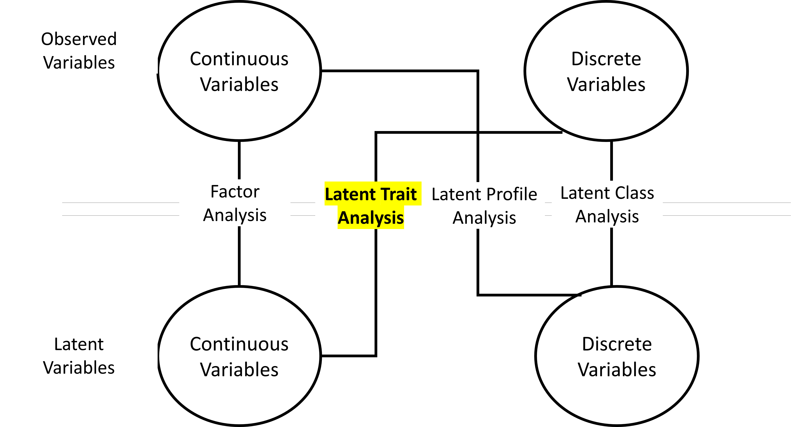

```{r setup, include=FALSE}
knitr::opts_chunk$set(echo = F, 
                      warning = F, 
                      message = F, 
                      fig.align = "center", 
                      out.width = "90%")
IRT <- function(theta, a = 1, b = 0, c = 0,e = 1) {
  y <- c + (e - c) * exp(a * (theta - b)) / (1 + exp(a * (theta - b)))
  y[is.na(y)] = 1
  return(y)
}

i_info <- function(b, a=1,c=0, theta = seq(-5,5,length.out=1000)){
 
P <- NULL 
Q <- NULL
Ii <- NULL
for(i in 1:1000){
  P[i] <- 1/(1+ exp (-a*(theta[i] - b)))
  Q[i]= 1-P[i]
  Ii[i] =(a*Q[i]*(P[i]-c)^2)/(P[i]*((1-c)^2)) # (3-PL)
   }
return(Ii)
}
# Function to get all item information
item_info <- function(b,a=1, c= 0){
item <- NULL
  for(i in 1:length(b)){
  item[[i]] <- i_info(b[i],a[i])
  }
return(item)
}

set.seed(999)

theta = seq(-4,4,length.out=1000)
library(xtable)
library(sirt)
library(TAM)

```

### Course website

\vspace*{5mm}

\centering

[https://ottaviae.github.io/IRTintro/](https://ottaviae.github.io/IRTintro/)


# Introduction

## Latent variables

### 

\vspace{5mm}

- Variables that \color{latenti} cannot be directly observed \normalcolor $\rightarrow$ **\color{latenti} Latent variables** (e.g., Intelligence)

- Inferred from \color{manifeste} directly observed  indicators \normalcolor $\rightarrow$ **\color{manifeste} Observed variables** (e.g., the response to the Raven's matrices)

- \emph{Operazionalization of the latent variable} is crucial 


### Example

Let's say we have a friend, Giorgio, and after observing what he does usually, we see that:

- He has a lot of friends

- He feels comfortable in social situations involving many people  

- He goes the extra mile to stay in touch with people 

- $\ldots$

Giorgio's behaviors (\color{manifeste}***observed variables***\normalcolor) can be explained by considering the \color{latenti}***latent variable*** extraversion


## Modelling latent variables

### 

The \color{latenti}latent variables \normalcolor must be linked to the \color{manifeste}observed variables\normalcolor $\rightarrow$ mathematical and statistical models


\small
Assumptions: 

-  The \color{latenti}latent variables \normalcolor are the underlying cause of the \color{manifeste}observed variables \normalcolor 

- *Local independence*: The correlation between the \color{manifeste}observed variables \normalcolor disappears after controlling for the influence of the \color{latenti}latent variable\normalcolor

\vspace{3mm}

```{r echo = F, out.width="60%"}
knitr::include_graphics("img/latent.png")
```


### To each its own

```{r out.width="80%", echo = F}

```

IRT models and Rasch model $\rightarrow$ **Models for latent trait** 


## IRT vs. CTT

### 

IRT models and Classical Test Theory (CTT) models have the same aim $\rightarrow$ "measuring" people $\rightarrow$ locate the position of each person on a latent trait


::: columns

:::: column
\begin{center}
\textbf{\large\high{IRT}}
\end{center}

Focus $\rightarrow$ \high{Items}
::::

:::: column
\begin{center}
\textbf{\large\high{CTT}}
\end{center}

Focus $\rightarrow$ \high{Test}
::::

:::


## Basics of IRT

### 

The probability of an observed response (\color{manifeste}observed variable\normalcolor) depends on the characteristics of both the \sbj{person} and the \colit{item}

The characteristics of the \sbj{person} can be described by a parameter of the person  $\rightarrow$ \color{latenti} latent trait \normalcolor (e.g., intelligence, self-esteem, extraversion etc.)


The characteristics of the \colit{item} can be described by one or more parameters (\textbf{difficulty}, \textbf{discrimination}, \textbf{guessing}, \textbf{careless error})

The item, the person and their characteristics are located on the same latent trait

### 


\begin{minipage}{.20\textwidth}
	\begin{figure}
				\centering
				\includegraphics[width=\linewidth]{img/lisa.png}
			\end{figure}

			\centering
			\sbj{$A_\text{Lisa}$}
			
\end{minipage}
\begin{minipage}{.25\textwidth}
\begin{center}
\textbf{Q1}

$3 + 2 = ?$

\colit{$d_{\text{Q1}}$}
\end{center}
\end{minipage}
\begin{minipage}{.25\textwidth}
\begin{center}
\textbf{Q2}

$3x - 2y + 4 = ?$

\colit{$d_{\text{Q2}}$}
\end{center}
\end{minipage}
\begin{minipage}{.20\textwidth}
	\begin{figure}
				\centering
				\includegraphics[width=\linewidth]{img/bart.png}
			\end{figure}

			\centering
			\sbj{$A_\text{Bart}$}
			
\end{minipage}

### To each its own... IRT model 

Different IRT models according to:

- Latent trait: 

  - Unidimensional model
  - Multidimensional model
  
- Response categories: 

  - Dichotomous items (Two response categories, e.g., true/falso, agree/disagree)
  - Polytomous items (at least 3 response categories, e.g., Likert-type scale)
  
### Models for dichotomous items

These models can be distinguinshed according to the number of parameters describing the charcateristics of the items. 

- One-Parameter Logistic Model (1-PL)

- Two-Parameter Logistic Model (2-PL; Birnbaum, 1968)

- Three-Parameter Logistic Model (3-PL; Lord, 1980)

- Four-Parameter Logistic Model (4-PL; Barton & Lord, 1981)

### In general

- Person and items parameters are on the same latent trait 

- As the distance on the latent trait between the person parameter and the item parameter increases, the probability of a correct response changes 

- When the parameter of the person matches the parameter of the item, then the probability of observing a correct response is 50% 

# 1-PL


## Item Response Function

###

The probability that person $p$ responds correctly to item $i$ is formalized as:


$$P(x_{pi} = 1| \theta_p, b_i) = \dfrac{\exp(\theta_p - b_i)}{1 + \exp(\theta_p - b_i)}$$


$\theta_p$: Ability of the person (i.e., latent trait level of the person) $\rightarrow$ The higher the value of $\theta_p$, the higher the amount of latent trait of $p$
      
$b_i$: Difficulty of item $i$ (location of the item on the latent trait) $\rightarrow$ The higher the value of  $b_i$, the most difficult the item is


## Item Characteristic Curve 

###

```{r echo = F, out.width = "100%"}
par(mar = c(5,7,4,2) + 0.1) 
plot(theta, IRT(theta, b = 1, a = 1),
     cex.lab= 2.5, 
     cex.axis =1.5, cex.main = 3,
       xlab = expression(theta),ylab = expression(paste("P(", x[p][i],  "= 1|", theta[p], ", ", b[i], ")")),
       xlim = c(-4, 4), ylim = c(0, 1), 
     type = "l", lwd = 3, 
     col = "royalblue", main = "Item Characteristic Curve (ICC)")

mtext("b = 1", side = 1, at = 1, cex = 2, padj = 1)

segments(-7, 0.5, 
         1, 0.5, 
         col = "red", lty = 3, lwd = 3)
segments(1, -0.5, 
         1, 0.5, 
         col = "red", lty = 3, lwd = 3)
```

### Items with different locations: ICC

\vspace*{-8mm}

```{r, out.width = "85%"}
b = seq(-2.5, 2.5, length = 5)
a = rep(1, length(b))

my_colors <- RColorBrewer::brewer.pal(6, "Blues")[2:6]

par(mar = c(5,7,4,2) + 0.1) 
plot(theta, IRT(theta, b = b[1], a = a[1]),
     cex.lab= 2, 
     cex.axis =1, cex.main = 2,
       xlab = expression(theta), ylab = expression(paste("P(", x[p][i],  "= 1|", theta[p], ", ", b[i], ")")), 
       xlim = c(-4, 4), ylim = c(0, 1), 
     type = "l", lwd = 3, 
     col = my_colors[1])
  
segments(-7, 0.5, 
         b[1], 0.5, 
         col = "red", lty = 3, lwd = 3)
segments(b[1], -0.5, 
         b[1], 0.5, 
         col = "red", lty = 3, lwd = 3)

si = data.frame(item1 = b[1], item2 = b[2], item3 = b[3], 
                item4 = b[4], item5 = b[5])
rownames(si) = "b"
text(x= -2, y = 0.8, colnames(si)[1], col = my_colors[1], cex = 2)


for ( i in 2:length(b)) {
  lines(theta, IRT(theta, b=b[i], 
                a = 1), 
      lty = 1, lwd=3, col = my_colors[i])
  segments(-7, 0.5, 
         b[i], 0.5, 
         col = "red", lty = 3, lwd = 3)
segments(b[i], -0.5, 
         b[i], 0.5, 
         col = "red", lty = 3, lwd = 3)
text(x= b[i] +.5, 
     y = 0.8, colnames(si)[i], col = my_colors[i], cex = 2)

}


```

\vspace{-3mm}
\centering 
\footnotesize

```{r results='asis'}
print(xtable(si), comment = FALSE, include.rownames=T)
```


## Item Information Function

###

Measure of the precision with which the item assesses different levels of the latent trait $\rightarrow$ \emph{Item Information Function}: 

$$IIF_i = P_i(\theta, b_i)Q_i(\theta, b_i)$$

$Q_i = 1- P_i(\theta_p, b_i)$ is the probability of choosing the incorrect response

###

The IIF is maximized when $\theta_p = b_i$ $\rightarrow$ $P(x_{pi}=1) = P(x_{pi}=0) =0.50$ $\rightarrow$ $I_i = .25$

\vspace{-2mm}

```{r prova}
b <- 1
a <- rep(1, length(b))
# Get all item information
c <- item_info(b,a)
Theta <- matrix(seq(-4,4, length.out=1000))
check <- data.frame(Theta, 
                    item_info = c[[1]])
d <- do.call('cbind',c)
sum_info1 <- rowSums(d)
par(mar = c(5,7,4,2) + 0.1) 
plot(check$Theta, check$item_info, ylim= c(0, 1), cex.lab= 2, 
     cex.axis =1.5, cex.main = 3,
       xlab = expression(theta),ylab = expression(paste("IIF"[i])), 
     type = "l", lwd =2, 
     col = "royalblue", main = "Item Information Function - IIF")
segments(-7, 0.25, 
         1, 0.25, 
         col = "red", lty = 3, lwd = 3)
segments(1, -0.25, 
         1, 0.25, 
         col = "red", lty = 3, lwd = 3)

lines(theta, IRT(theta, b=1, 
                a = 1), 
      lty = 2, lwd=3, col = "grey")
```

### 

The item is mostly informative for subjects with a latent trait level close to the location of the item $\rightarrow$ the higher the distance between the latent trait level of the person and the location of the item, the lower the IIF

High variability in the latent trait levels of the respondents $\rightarrow$ items with locations spread along the entire latent trait 

::: columns

:::: column

\begin{center}
\large{\textbf{\high{IRT}}} 
\end{center}

The more the item locations are spread along the trait, the merrier

::::

:::: column
\begin{center}
\large{\textbf{\high{CTT}}} 
\end{center}

Items should be as homogeneous as possible

::::


:::


### Items with difference locations: IIFs

\vspace*{-5mm}

```{r out.width="85%"}

b = seq(-2.5, 2.5, length = 5)
a = rep(1, length(b))

my_colors <- RColorBrewer::brewer.pal(6, "Blues")[2:6]
a <- rep(1, length(b))
# Get all item information
c <- item_info(b,a)
Theta <- matrix(seq(-4,4, length.out=1000))
check = data.frame(theta = Theta)
temp = NULL
for (i in 1:length(c)) {
  temp = cbind( temp, c[[i]])
}

check = cbind(check, temp)
colnames(check)[2:ncol(check)] = paste0("item_info", 1:(ncol(check)-1))

d <- do.call('cbind',c)
sum_info <- rowSums(d)

check$theta = NULL
par(mar = c(5,7,4,2) + 0.1) 
plot(Theta, check[, 1], ylim= c(0, 1), cex.lab= 2, 
     cex.axis =1.5, cex.main =2.5,
       xlab = expression(theta), ylab = expression(paste("IIF"[i])), 
     # main = "IIF- Items with different locations",
     type = "l", lwd =2, 
     col = my_colors[1])
segments(-7, 0.25, 
         b[1], 0.25, 
         col = "red", lty = 3, lwd = 3)
segments(b[1], -0.25, 
         b[1], 0.25, 
         col = "red", lty = 3, lwd = 3)


text(x= -2, y = 0.4, colnames(si)[1], col = my_colors[1], cex = 2)


for ( i in 2:length(b)) {
  lines(theta, check[, i], 
      lty = 1, lwd=3, col = my_colors[i])
  segments(-7, 0.25, 
         b[i], 0.25, 
         col = "red", lty = 3, lwd = 3)
segments(b[i], -0.25, 
         b[i], 0.25, 
         col = "red", lty = 3, lwd = 3)
text(x= b[i] +.5, 
     y = 0.4, colnames(si)[i], col = my_colors[i], cex = 2)

}

for ( i in 2:length(b)) {
  lines(theta, IRT(theta, b=b[i], 
                a = 1), 
      lty = 1, lwd=2, col = "grey")
}

si = data.frame(item1 = b[1], item2 = b[2], item3 = b[3], 
                item4 = b[4], item5 = b[5])
rownames(si) = "b"
```

\vspace{-3mm}
\centering 
\footnotesize

```{r results='asis'}
print(xtable(si), comment = FALSE, include.rownames=T)
```

## Test Information Function

###

Measure of the precision with which the test assesses the latent trait:

$$TIF = \sum_{i = 1}^{I} IIF_i$$


### 

<!-- \vspace*{-5mm} -->

```{r}
par(mar = c(5,7,4,2) + 0.1) 
plot(theta, sum_info, cex.lab= 2, 
     cex.axis =1.5,
       xlab = expression(theta), ylab = expression(paste("IIF"[i])), 
     type = "l", lwd =2, 
     col = "black", ylim = c(0,1))

for ( i in 1:length(b)) {
  lines(theta, check[, i], 
      lty = 1, lwd=3, col = my_colors[i])
}
```
\centering 
\small
\vspace{-3mm}
```{r results='asis'}
print(xtable(si), comment = FALSE, include.rownames=T)
```


### Standard Error of Measurement (SEM)


$$SEM(\theta) = \sqrt{\dfrac{1}{TIF}}$$
The higher the information, the lower the SEM

The lower the information, the higher the SEM

Differently from CTT $\rightarrow$ the error of measuremt can vary for different levels of the latent trait


### 

<!-- \vspace*{-5mm} -->

```{r}
par(mar = c(5,7,4,2) + 0.1) 
plot(theta, sqrt(1/sum_info), cex.lab= 2, 
     cex.axis =1.5,
       xlab = expression(theta), ylab = "SEM", 
     type = "l", lwd =2, 
     col = "firebrick")
text("SEM", x =-3, y = 3.0, col = "firebrick", cex = 2)
par(new = TRUE)
plot(theta, sum_info, type = "l", axes = FALSE,
     bty = "n", xlab = "", ylab = "", ylim = c(0,1))
text("TIF", x = 0, y = .7, cex = 2)
axis(side=4, at = pretty(range(sum_info)), cex = 1.5)
mtext("Information", side=4, line=3, cex = 2)

```

\vspace{-3mm}
\centering 
\footnotesize

```{r results='asis'}
print(xtable(si), comment = FALSE, include.rownames=T)
```

# 2-PL

## Item Response Function

### 

Birnbaum (1968):

$$P(x_{pi} = 1| \theta_p, b_i, a_i) = \dfrac{\exp[a_i(\theta_p - b_i)]}{1+\exp[a_i(\theta_p - b_i)]}$$

$\theta_p$: Ability of the person (i.e., latent trait level of the person)
      
$b_i$: Difficulty of item $i$ (location of the item on the latent trait) 

$a_i$: Discrimination of the item $\rightarrow$ ability of the item to tell apart subjects with different levels of the latent trait

### Maybe better

\vspace*{-5mm}
\begin{overprint}
	
\onslide<1>

```{r}
par(mar = c(5,7,4,2) + 0.1) 
library(png)
# lisa = readPNG(paste0(getwd(), "/intro/img/lisa.png"))
# bart =readPNG(paste0(getwd(), "/intro/img/bart.png"))

lisa = readPNG( "img/lisa.png")
bart = readPNG( "img/bart.png")

plot(theta, IRT(theta, a = 0.5, b = 1), 
     type = "l", 
     ylab = expression(paste("P(", x[p][i],  "= 1|", theta[p], ", ", b[i], ", ", a[i], ")")), ylim = c(0,1 ), cex.lab= 2, 
     cex.axis =1.5, xlab = expression(theta), lwd = 3)


rasterImage(lisa, 0.6, -0.10, 1.5, 0.15)
rasterImage(bart, -1.5, -0.10, -0.5, 0.15)

text(x= 3.2, 
     y = 0.95, expression(paste(a[1], "= 0.50")), 
     col = "black", cex = 2)


```

\vspace{-3mm}
\begin{columns}[T]

\begin{column}{.50\linewidth}

Item 1 ($a_1 = 0.50$): 

$2 + 2= ?$
\end{column}

\begin{column}{.50\linewidth}

\end{column}

\end{columns}


\onslide<2>

```{r}
par(mar = c(5,7,4,2) + 0.1) 
plot(theta, IRT(theta, a = 0.5, b = 0), 
     type = "l", 
     ylab = expression(paste("P(", x[p][i],  "= 1|", theta[p], ", ", b[i], ", ", a[i], ")")), ylim = c(0,1 ), cex.lab= 2, 
     cex.axis =1.5, xlab = expression(theta), lwd = 3)
text(x= 3.2, 
     y = 0.95, expression(paste(a[1], "= 0.50")), 
     col = "black", cex = 2)

segments(-7, exp(0.5 *(1))/(1+exp(0.5 *(1))), 
         1, exp(0.5 *(1))/(1+exp(0.5 *(1))), 
         col = "red", lty = 3, lwd = 3)
segments(1, -exp(0.5 *(1))/(1+exp(0.5 *(1))), 
        1, exp(0.5 *(1))/(1+exp(0.5 *(1))), 
         col = "red", lty = 3, lwd = 3)

segments(-7, exp(0.5 *(-1))/(1+exp(0.5 *(-1))), 
         -1, exp(0.5 *(-1))/(1+exp(0.5 *(-1))), 
         col = "royalblue4", lty = 3, lwd = 3)
segments(-1, -exp(0.5 *(-1))/(1+exp(0.5 *(-1))), 
        -1, exp(0.5 *(-1))/(1+exp(0.5 *(-1))), 
         col = "royalblue4", lty = 3, lwd = 3)
rasterImage(lisa, 0.6, -0.10, 1.5, 0.15)
rasterImage(bart, -1.5, -0.10, -0.5, 0.15)

```

\vspace{-3mm}
\begin{columns}[T]

\begin{column}{.50\linewidth}

Item 1 ($a_1 = 0.50$): 

$2 + 2= ?$
\end{column}

\begin{column}{.50\linewidth}

\end{column}

\end{columns}


\onslide<3>

```{r}
par(mar = c(5,7,4,2) + 0.1) 
plot(theta, IRT(theta, a = 0.5, b = 0), 
     type = "l", 
     ylab = expression(paste("P(", x[p][i],  "= 1|", theta[p], ", ", b[i], ", ", a[i], ")")), ylim = c(0,1 ), cex.lab= 2, 
     cex.axis =1.5, xlab = expression(theta), lwd = 3)
text(x= 3.2, 
     y = 0.95, expression(paste(a[1], "= 0.50")), 
     col = "black", cex = 2)

segments(-7, exp(0.5 *(1))/(1+exp(0.5 *(1))), 
         1, exp(0.5 *(1))/(1+exp(0.5 *(1))), 
         col = "red", lty = 3, lwd = 3)


segments(-7, exp(0.5 *(-1))/(1+exp(0.5 *(-1))), 
         -1, exp(0.5 *(-1))/(1+exp(0.5 *(-1))), 
         col = "royalblue4", lty = 3, lwd = 3)

 lines(theta, IRT(theta, a = 2.5, b = 0), 
      lty = 1, lwd=3, col = "springgreen")
text(x= -0.8, 
     y = 0.75, expression(paste(a[2], "= 2.50")), 
     col = "springgreen", cex = 2)

segments(-7, exp(2.5 *(1))/(1+exp(2.5 *(1))), 
         1, exp(2.5 *(1))/(1+exp(2.5 *(1))), 
         col = "red", lty = 3, lwd = 3)
segments(1, -exp(2.5 *(1))/(1+exp(2.5 *(1))), 
        1, exp(2.5 *(1))/(1+exp(2.5 *(1))), 
         col = "red", lty = 3, lwd = 3)

segments(-7, exp(2.5 *(-1))/(1+exp(2.5 *(-1))), 
         -1, exp(2.5 *(-1))/(1+exp(2.5 *(-1))), 
         col = "royalblue4", lty = 3, lwd = 3)
segments(-1, -exp(0.5 *(-1))/(1+exp(0.5 *(-1))), 
        -1, exp(0.5 *(-1))/(1+exp(0.5 *(-1))), 
         col = "royalblue4", lty = 3, lwd = 3)
rasterImage(lisa, 0.6, -0.10, 1.5, 0.15)
rasterImage(bart, -1.5, -0.10, -0.5, 0.15)


```
	
	\vspace{-3mm}
\begin{columns}[T]

\begin{column}{.50\linewidth}

Item 1 ($a_1 = 0.50$): 

$2 + 2= ?$
\end{column}

\begin{column}{.50\linewidth}

Item 2 ($a_2 = 2.50$): 

$5 + 14 = ?$

\end{column}

\end{columns}

	
\end{overprint}


### Negative discrimination

\vspace*{-5mm}

```{r out.width ="70%"}
par(mar = c(5,7,4,2) + 0.1) 
plot(theta, IRT(theta, a = -0.5, b = 0), 
     type = "l", cex.main = 3, 
     ylab = expression(paste("P(", x[p][i],  "= 1|", theta[p], ", ", b[i], ", ", a[i], ")")), ylim = c(0,1 ), cex.lab= 2, 
     cex.axis =1.5, xlab = expression(theta), lwd = 3)
text(x= 3.2, 
     y = 0.95, expression(paste(a[1], "= -0.50")), 
     col = "black", cex = 2)

segments(-7, 0.5, 
         0, 0.5, 
         col = "red", lty = 3, lwd = 3)
segments(0, -0.5, 
        0, 0.5, 
         col = "red", lty = 3, lwd = 3)

```

\footnotesize

The higher the level of the latent trait... the lower the probability of responding correctly! 


###  

\vspace*{-5mm}

```{r}
a = c(0.5, 0.9, 1.5, 1.5)
b = c(rep(0, (length(a) -1)), 2)

my_colors <- RColorBrewer::brewer.pal(6, "Blues")[2:6]
my_col = c(my_colors[1:2], my_colors[5], my_colors[5])

par(mar = c(5,7,4,2) + 0.1) 
plot(theta, IRT(theta, b = b[1], a = a[1]),
     cex.lab= 2.5, 
     cex.axis =1.5,
       xlab = expression(theta),ylab =expression(paste("P(", x[p][i],  "= 1|", theta[p], ", ", b[i], ", ", a[i],  ")")),
       xlim = c(-4, 4), ylim = c(0, 1), 
     type = "l", lwd = 3, 
     col = my_colors[1])
  
segments(-7, 0.5, 
         b[1], 0.5, 
         col = "red", lty = 3, lwd = 3)
segments(b[1], -0.5, 
         b[1], 0.5, 
         col = "red", lty = 3, lwd = 3)

si = data.frame(item1 = c(b[1], a[1]), 
                item2 = c(b[2], a[2]), 
                item3 = c(b[3], a[3]), 
                item4 = c(b[4], a[4]))
rownames(si) = c("b", "a")

text(x= -2, y = 0.3, colnames(si)[1], col = my_col[1], cex = 2)


for ( i in 2:length(b)) {
  lines(theta, IRT(theta, b=b[i], 
                a = a[i]), 
      lty = 1, lwd=3, col = my_col[i])
  segments(-7, 0.5, 
         b[i], 0.5, 
         col = "red", lty = 3, lwd = 3)
segments(b[i], -0.5, 
         b[i], 0.5, 
         col = "red", lty = 3, lwd = 3)


}

text(x= b[2] -.5, 
     y = 0.6,  colnames(si)[2], col = my_col[2], cex = 2)

text(x= b[3] +.7, 
     y = 0.8,  colnames(si)[3], col = my_col[3], cex = 2)
text(x= b[4] +.7, 
     y = 0.8,  colnames(si)[4], col = my_col[4], cex = 2)
```

\centering 
\small
\vspace{-3mm}

```{r results='asis'}
print(xtable(si), comment = FALSE, include.rownames=T)
```

### $a \to \infty$ 

```{r}
par(mar = c(5,7,4,2) + 0.1) 
theta1 = seq(-4, 4, length.out = 15000)
plot(theta1, IRT(theta1, a = 200, b = 0), 
     type = "l", 
     ylab = expression(paste("P(", x[p][i],  "= 1|", theta[p], ", ", b[i], ", ", a[i],  ")")), 
     ylim = c(0,1 ), cex.lab= 2, 
     cex.axis =1.5, xlab = expression(theta), lwd = 3, col = "firebrick")


```

## Item Information Function


### 

\vspace*{-5mm}

```{r}
a = c(0.5, 0.9, 1.5, 1.5)
b = c(rep(0, (length(a) -1)), 2)
# my_colors <- RColorBrewer::brewer.pal(6, "Blues")[2:6]

par(mar = c(5,7,4,2) + 0.1) 

si = data.frame(item1 = c(b[1], a[1]), 
                item2 = c(b[2], a[2]), 
                item3 = c(b[3], a[3]), 
                item4 = c(b[4], a[4]))
rownames(si) = c("b", "a")


c <- item_info(b,a)
Theta <- matrix(seq(-4,4, length.out=1000))
check = data.frame(theta = Theta)
temp = NULL
for (i in 1:length(c)) {
  temp = cbind( temp, c[[i]])
}

check = cbind(check, temp)
colnames(check)[2:ncol(check)] = paste0("item_info", 1:(ncol(check)-1))

d <- do.call('cbind',c)
sum_info <- rowSums(d)

check$theta = NULL

plot(Theta, check[, 1], ylim= c(0, 1), cex.lab= 2, 
     cex.axis =1.5,
       xlab = expression(theta), ylab = expression(paste("IIF"[i])), 
     type = "l", lwd =2, 
     col = my_col[1])


#text(x= -2, y = 0.4, colnames(si)[1], col = my_col[1], cex = 2)

for ( i in 2:length(b)) {
  lines(theta, check[, i], 
      lty = 1, lwd=3, col = my_col[i])


}

for ( i in 1:length(b)) {
  lines(theta, IRT(theta, b=b[i], 
                a = a[i]), 
      lty = 1, lwd=2, col = "grey")
}


# text(x= b[2] -.5, 
#      y = 0.4,  colnames(si)[2], col = my_colors[2], cex = 2)
# 
# text(x= b[3] +.1, 
#      y = 0.4,  colnames(si)[3], col = my_colors[3], cex = 2)
# text(x= b[4] +.7, 
#      y = 0.4,  colnames(si)[4], col = my_colors[4], cex = 2)
```

\vspace{-3mm}

:::: {.columns}

::: {.column}
\small

$IIF_i = a_i^2P_i(\theta, b_i, a_i)Q_i(\theta, b_i, a_i)$
:::


::: {.column}
\centering
\small

```{r results='asis'}
print(xtable(si), comment = F)
```


:::

::::


## Test Information Function


### 

\vspace*{-5mm}

```{r out.width="85%"}
plot(theta, sum_info, cex.lab= 2, 
     cex.axis =1.5,
       xlab = expression(theta), ylab = "TIF", 
     type = "l", lwd =2, 
     col = "black", ylim = c(0,1))

for ( i in 1:length(b)) {
  lines(theta, check[, i], 
      lty = 1, lwd=3, col = my_colors[i])
}
```

\vspace{-3mm}

:::: {.columns}

::: {.column}

$$TIF = \sum_{i = 1}^{I} IIF_i $$

:::

::: {.column}

\centering 

\small
```{r results='asis'}
print(xtable(si), comment = FALSE, include.rownames=T)
```
:::

::::


### Standard Error of Measurement (SEM)


\vspace*{-8mm}

```{r out.width="75%"}

par(mar = c(5, 4, 4, 4) + 0.3)  # Leave space for z axis
plot(theta, sqrt(1/sum_info), cex.lab= 2, 
     cex.axis =1.5,
       xlab = expression(theta), ylab = "SEM", 
     type = "l", lwd =2, 
     col = "firebrick")
text("SEM", cex = 2, x = -2.5, y = 3, col = "firebrick")
par(new = TRUE)
plot(theta, sum_info, type = "l", axes = FALSE,
     bty = "n", xlab = "", ylab = "", ylim = c(0,1))
text("TIF", x = 0, y = .7, cex = 2)
axis(side=4, at = pretty(range(sum_info)), cex = 1.5)
mtext("Information", side=4, line=3, cex = 2)

```

\vspace{-3mm}

:::: {.columns}

::: {.column}

\footnotesize

$$SEM(\theta) = \sqrt{\dfrac{1}{TIF}} $$

::: 


::: {.column}

\centering 
\footnotesize

```{r results='asis'}
print(xtable(si), comment = FALSE, include.rownames=T)
```

:::

:::: 


# 3-PL 

## Item Response Function

### 

The lower asymptote is moved upward by adding a third item parameter, the pseudo-guessing ($c_i$):

$$P(x_{pi} = 1| \theta_p, b_i, a_i) = c_i + (1 - c_i) \dfrac{\exp[a_i(\theta_p - b_i)]}{1+\exp[a_i(\theta_p - b_i)]}$$


$\theta_p$: Ability of the person (i.e., latent trait level of the person)
      
$b_i$: Difficulty of item $i$ (location of the item on the latent trait) 

$a_i$: Discrimination of the item $\rightarrow$ ability of the item to tell apart subjects with different levels of the latent trait

$c_i$: pseudo-guessing of item $i$ $\rightarrow$ probability of giving the correct response even if the latent trait approaches $-\infty$


### 


:::: {.columns}

::: {.column}
\small
Item 1: $b_1 = 0$, $a_1 = 1.4$, $c_1 = 0.20$ 
:::

::: {.column}
\small
Item 2: $b_2 = 0$, $a_2 = 1.4$, $c_2 = 0.30$ 
:::

::::
\vspace{-3mm}
```{r, out.width="80%"}
b = c(0, 1)
a = c(1.4, 1.4)
g = c(0.20, 0.30)

plot(theta, IRT(theta, a = a[1], b = b[1], c= g[1]), 
     type = "l", 
     ylab = expression(paste("P(", x[p][i],  "= 1|", theta[p], ", ", b[i], ", ", a[i], ", ", c[i], ")")), 
     ylim = c(0,1 ), cex.lab= 2, 
     cex.axis =1.5, 
     xlab = expression(theta), lwd = 3, col = my_colors[1])
text(x= -0.4, 
     y = 0.90, "item1", 
     col = my_colors[1], cex = 2)

abline(h = .20, lty = 2, lwd = 2, col = "red")
abline(h = .30, lty = 2, lwd = 2, col = "red")
lines(theta, IRT(theta, a = a[2], b = b[2], c= g[2]), 
     col = my_colors[5], lwd = 3)
text(x= 3.2, 
     y = 0.90, "item2", 
     col = my_colors[5], cex = 2)

```

\vspace{-3mm}
\small
The probability of responding correctly is approximately $c$ (0.20, 0.30) when $\theta \rightarrow -\infty$


###

\small


```{r out.width="80%"}
b = c(0, 1)
a = c(1.4, 1.4)
g = c(0.20, 0.30)

plot(theta, IRT(theta, a = a[1], b = b[1], c= g[1]), 
     type = "l", 
     ylab = "P(x = 1)", ylim = c(0,1 ), cex.lab= 2, 
     cex.axis =1.5, 
     xlab = expression(theta), lwd = 3, col = my_colors[1])
text(x= -0.4, 
     y = 0.90, "item1", 
     col = my_colors[1], cex = 2)

abline(h = .20, lty = 2, lwd = 2, col = "red")
abline(h = .30, lty = 2, lwd = 2, col = "red")
lines(theta, IRT(theta, a = a[2], b = b[2], c= g[2]), 
     col = my_colors[5], lwd = 3)
text(x= 3.2, 
     y = 0.90, "item2", 
     col = my_colors[5], cex = 2)


```

The probability of responding correctly when $\theta_p = b_i$ is higher than $.50$: $P(x_{pi} = 1) = c + (1 - c)/2$

### 

In multiple-choice items $\rightarrow$ subjects with low levels of the latent trait might try to guess the correct response

If there are $k$ response options that are all equally plausible, then $c \cong \dfrac{1}{k}$

\begin{alertblock}{WARNING}

Assumption: All the response options are equally plausible
\end{alertblock}


## Item Information Function

### 


$$IIF_i = a^2 \dfrac{P_i(\theta, b_i, a_i, c_i)}{Q_i(\theta, b_i, a_i, c_i)} \left[\dfrac{P_i(\theta, b_i, a_i, c_i) -c_i}{1 -c_i}\right]$$

The higher the guessing, the lower the IIF


### 
\vspace*{-5mm}

```{r}
i_info <- function(b = 0, a=1,g=0, guessing = F, theta=seq(-4,4,length.out=1000)){
 
P <- NULL 
Q <- NULL
Ii <- NULL

for(i in 1:1000){
  P[i] <- g + (1 -g) * (exp(a *(theta[i] - b))/(1 + exp(a *(theta[i] - b))))
  Q[i]= 1-P[i]
  
  if (guessing == F) {
    Ii[i] = a^2 *P[i]*Q[i]
  } else {
    Ii[i] = a^2 *(Q[i]/P[i]) * ((P[i] - g)/(1-g))^2
  }
   }
return(Ii)
}

item_info <- function(b,a=1,g = 0, guessing = NULL){
item <- NULL
  for(i in 1:length(b)){
  item[[i]] <- i_info(b[i],a[i], g[i], guessing = guessing)
  }
return(item)
}

par(mar = c(5,7,4,2) + 0.1) 


si = data.frame(item1 = c(b[1], a[1], g[1]), 
                item2 = c(b[2], a[2], g[2]))
rownames(si) = c("b", "a", "c")


c <- item_info(b,a, g, guessing = T)
Theta <- matrix(seq(-4,4, length.out=1000))
check = data.frame(theta = Theta)
temp = NULL
for (i in 1:length(c)) {
  temp = cbind( temp, c[[i]])
}

check = cbind(check, temp)
colnames(check)[2:ncol(check)] = paste0("item_info", 1:(ncol(check)-1))

d <- do.call('cbind',c)
sum_info <- rowSums(d)


check$theta = NULL

plot(Theta, check[, 1], ylim= c(0, 1), cex.lab= 2, 
     cex.axis =1.5,
       xlab = expression(theta), ylab = expression(paste("IIF"[i])), 
     type = "l", lwd =2, 
     col = my_colors[1])

text(x= 0, y = 0.4, colnames(si)[1], col = my_colors[1], cex = 2)

for ( i in 2:length(b)) {
  lines(theta, check[, i], 
      lty = 1, lwd=3, col = my_colors[i])
}
text(x= 2, y = 0.2, colnames(si)[2], col = my_colors[2], cex = 2)


for ( i in 1:length(b)) {
  lines(theta, IRT(theta, b=b[i], 
                a = a[i], c=g[i]), 
      lty = 1, lwd=2, col = "grey")
}


```

\centering
\footnotesize
\vspace{-5mm}

```{r results='asis'}
print(xtable(si), comment = F)
```


## Test Information Function

### 

\vspace*{-8mm}

```{r}
plot(theta, sum_info, cex.lab= 2, 
     cex.axis =1.5,
       xlab = expression(theta), ylab = "Information", 
     type = "l", lwd =2, 
     col = "black", ylim = c(0,1))

for ( i in 1:length(b)) {
  lines(theta, check[, i], 
      lty = 1, lwd=3, col = my_colors[i])
}
```

\vspace{-4mm}
:::: {.columns}

::: {.column}
\small
$$TIF= \sum_{i = 1}^{I} IIF_i $$
:::

::: {.column}
\footnotesize
```{r results='asis'}
print(xtable(si), comment = FALSE)
```

:::

::::


### Standard Error of Measurement (SEM)


\vspace*{-10mm}

```{r}

par(mar = c(5, 4, 4, 4) + 0.3)  # Leave space for z axis
plot(theta, sqrt(1/sum_info), cex.lab= 2, 
     cex.axis =1.5,
       xlab = expression(theta), ylab = "SEM", 
     type = "l", lwd =2, 
     col = "firebrick")
text("SEM", col = "firebrick", cex =2, x = -2.5, y = 80)
par(new = TRUE)
plot(theta, sum_info, type = "l", axes = FALSE,
     bty = "n", xlab = "", ylab = "", ylim = c(0,1))
text("TIF", x = 1, y = .5, cex = 2)
axis(side=4, at = pretty(range(sum_info)), cex = 1.5)
mtext("Information", side=4, line=3, cex = 2)

```

\vspace{-5mm}
:::: {.columns}

::: {.column}
\footnotesize

$$SEM(\theta) = \sqrt{\dfrac{1}{TIF}}$$
:::

::: {.column}

\scriptsize
```{r results='asis'}
print(xtable(si), comment = FALSE, include.rownames=T)
```
:::
::::

# 4-PL

## Item Response Function

### 

Lower the upper asymptote by adding a \textbf{careless error} parameter

$$P(x_{pi} = 1| \theta_p, b_i. a_i) = c_i + (d_i - c_i) \dfrac{\exp[a_i(\theta_p - b_i)]}{1+\exp[a_i(\theta_p - b_i)]}$$

$\theta_p$: Ability of the person (i.e., latent trait level of the person)

$b_i$, $a_i$, $c_i$; Difficulty, discrimination, and pseduo-guessing of item $i$

$d_i$: careless-error, probability of endorsing the item when the latent trait approaches $+ \infty$


The lower the value of $d_i$, the lower the probability that a person with high level of the latent trait gives the correct response to item $i$


###

\begin{columns}[T]
\begin{column}{.50\linewidth}
Item 1: $b_1 = 0$, $a_1 = 1.4$, $c_1=0.20$, $d_1 = .9$
\end{column}
\begin{column}{.50\linewidth}
Item 2: $b_2 = 0$, $a_2 = 1.4$, $c_2=0.30$, $d_2 = .85$
\end{column}
\end{columns}


```{r}
b = rep(0, 2)
a = c(1.4, 1.4)
g = c(0.20, 0.30)
d = c(.9, .85)

plot(theta, IRT(theta, a = a[1], b = b[1], c= g[1], e = d[1]), 
     type = "l", 
     ylab = expression(paste("P(", x[p][i],  "= 1|", theta[p], ", ", b[i], ", ", a[i], ")")), 
     ylim = c(0,1 ), cex.lab= 2, 
     cex.axis =1.5, 
     xlab = expression(theta), lwd = 3, col = my_colors[1])
text(x= -0.4, 
     y = 0.90,  "item1", 
     col = my_colors[1], cex = 2)

abline(h = .90, lty = 2, lwd = 2, col = "red")
abline(h = .70, lty = 2, lwd = 2, col = "red")
abline(h = .20, lty = 2, lwd = 2, col = "red")
abline(h = .30, lty = 2, lwd = 2, col = "red")
lines(theta, IRT(theta, a = a[2], b = b[2], c= g[2], e = d[2]), 
     col = my_colors[5], lwd = 3)
text(x= 3.2, 
     y = 0.80, "item2", 
     col = my_colors[5], cex = 2)
```


### Item Information Function
Given $P(\theta) = P(\theta, b_i, a_i, c_i, d_i)$ and $Q(\theta) = \- P(\theta, b_i, a_i, c_i, d_i)$,

\vspace{3mm}

$$IIF_i = \dfrac{a^2[P(\theta)-c_i]^2[d_i - P(\theta)]^2}{(d_i-c_i)^2 P(\theta)Q(\theta)}$$

### Careless error and $IIF_i$

```{r}
par(mar = c(5,7,4,2) + 0.1) 

i_info <- function(b, a=1,c=0, e= 1,  theta = seq(-5,5,length.out=1000)){
  P = IRT(theta, b = b, a = a, e = e, c=c)
  Q = 1 - P 
  # Ii = (a^2)*(Q/P)*((P-c)/(e-c))^2
  # Ii = (a^2)*(Q*P/e^2)
  num = (a^2)*((P-c)^2)*((e-P)^2)
  den = ((e-c)^2)*P*Q
  Ii = num/den
  return(Ii)
}

item_info <- function(ipar, theta = seq(-5,5,length.out=1000)){
  item <- NULL
    for(i in 1:nrow(ipar)){
      item[[i]] <- i_info(b = ipar[i, "b"],a = ipar[i, "a"], c = ipar[i, "c"], e = ipar[i, "e"], theta = theta)
    }
  item = data.frame(do.call("cbind", item))
  colnames(item) = rownames(ipar)
  return(item)
}

set.seed(666)
original_q = data.frame(b = runif(5, -3, 3), 
               a = runif(5, .9, 2), 
               c = rep(0,5), e= rep(1, 5))
rownames(original_q) = paste("item", 1:nrow(original_q), sep ="_")
theta = seq(-4, 4, length.out = 1000)

all_iif = item_info(original_q, theta)
tif = data.frame(theta, tif = rowSums(all_iif), 
                 mean_tif = rowMeans(all_iif))
par(mar = c(5,7,4,2) + 0.1) 

plot(theta, all_iif$item_1, type = "l", lwd = 2, col ="gray58", ylim = c(0, 1),  
     ylab = expression(paste("IIF"[i])), xlab = expression(theta), cex.lab = 2)
for (i in 2:ncol(all_iif)) {
  lines(theta, all_iif[,i], type = "l", lwd = 2, col ="gray58")
}
# metto la stanchezza 
# uso una funzione esponenziale exp(-kn)
# dove k è il parametro di velocità della stanchezza
# n è l'n item somministrato 
tired_q = original_q
tired_q$e = sample(seq(.92, .98, length.out = nrow(tired_q)))
tired_iif = item_info(tired_q, theta)
tired_tif = data.frame(theta, tired_tif = rowSums(tired_iif), 
                       mean_tired_tif = rowMeans(tired_iif))
for (i in 1:ncol(tired_iif)) {
  lines(theta, tired_iif[,i], type = "l", lwd = 2, col ="firebrick")
}
legend(x = -1.2, y = .95, cex = 2, 
       legend = c("Without d", "With d"), 
       fill = c("gray58", "firebrick"))


```

### Careless error and TIF


```{r}
par(mar = c(5,7,4,2) + 0.1) 

plot(theta, tif$tif, type = "l", lwd = 2, col ="gray58", ylim = c(0, 1.8),  
     ylab = "TIF", xlab = expression(theta), cex.lab = 2)
lines(theta, tired_tif$tired_tif, lwd = 2, col = "firebrick")
legend(x = -1, y = 1.75, cex = 2, 
       legend = c("Without d", "With d"), 
       fill = c("gray58", "firebrick"))
```


# Relationship between models


###


- Constraining the $d_i$ parameters of all items to be 1 $\rightarrow$ from 4-PL to 3-PL

- Constraining the $c_i$ parameters of all items to be 0 $\rightarrow$ from 3-PL to 2-PL

- Constraining the $a_i$ parameters of all items to be 1 $\rightarrow$ from 2-PL to 1-PL

### The Rasch Model?

Formally, the Rasch model and the 1-PL are the same model


::: columns

:::: column

\begin{center}
\high{IRT}


\end{center}
\high{Fit of the \textbf{models} to the data} 

The model that fits better the data is chosen

::::

:::: column
\begin{center}
\high{Rasch}
\end{center}

\high{Fit of the data to the \textbf{model}} 

The data are modified as long as they don't fit to the model

\vspace{5mm}

```{r fig.align='right', out.width="50%"}

```

:::


:::

## All models are wrong...

### 

The model can be chosen

- A priori: 

  - Theoretical considerations
  - Item characteristics

- A posteriori: 
  
  - Estimation of all the IRT models
  - Model comparison


### A posteriori 

Comparative fit indexes

- $-$\emph{2loglikelihood} $\rightarrow$ nested models only

- Akaike's Information Criterion (AIC)

- Bayesian Information Criterion (BIC)


### $-$\emph{2loglikelihood}

It is the difference between the \emph{LogLikelihood}  of two nested models (multiplied by $-2$). 

The significance of the difference between the \emph{LogLikelihood} can be tested considering a $\chi^2$ distribution with degrees of freedom equal to the difference in the degrees of freedom of the two nested models:

- Significant difference: The most complex model is the best one 

- Non significant difference: The simplest model is the best one

### Entropy

AIC and BIC are entropy indexes $\rightarrow$ the lower the better

AIC penalizes most complex models regardless of the sample size

$$AIC = -2logLik + 2p$$


BIC penalizes most complex models also accounting for the  sample size

$$BIC = -2logLik + p \cdot log(N)$$


